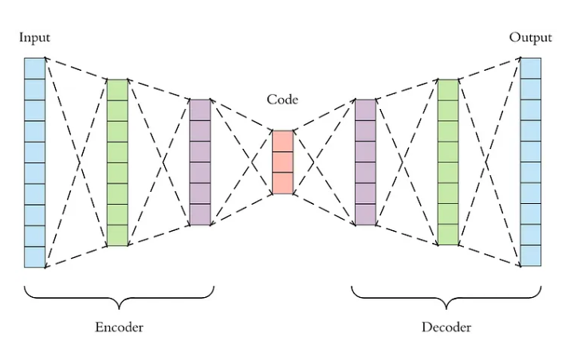
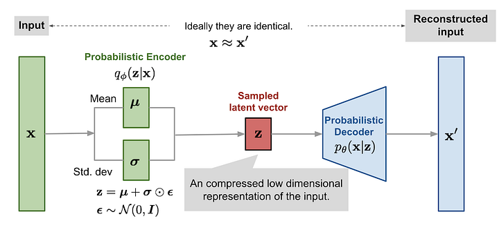

# VAE (Variational Autoencoders)  
## Autoencoders  
Autoencoders are consists of two parts, the encoder and decoder.   

The Encoder takes in the data and performs dimensionality reduction (similar to PCA) there by converting the input data (here image) to a latent vector. This latent vector consists of key features of the original data. The Decoder performs reconstruction of the latent vector to original data. The optimisation of Autoencoder models is done by finding the reconstruction loss given by:   $$loss = arg\ min \ error(x, d(e(x))$$
The key factor to be considered in Auto Encoders is that the model should not be made complex. If done so, it would lead the decoder to perfectly mimic the input data acting like an identity function of no use case. Hence, the model should be compact.  One more approach to make the autoencoder to learn useful features alone is to add noise to input. This would make the encoder to pick up prominent features.   

Regularisation can be used on encoders (Sparse Autoencoders). We can regularise the autoencoder by using a _sparsity constraint_ such that only a fraction of the nodes would have nonzero values, called active nodes. We add a penalty term to the loss function such that only a fraction of the nodes become active. This forces the autoencoder to represent each input as a combination of small number of nodes, and demands it to discover interesting structure in the data. This method works even if the code size is large, since only a small subset of the nodes will be active at any time.  

Autoencoders are used for noise removal in high dimensions (images) and image generations such as VAEs.   

## Variational Autoencoders  
Similar to standard encoders, VAEs encode data. But along with compression of input data, VAEs recognise the distribution of the data. This makes them useful as a Generative models. A variational autoencoder can be defined as being an autoencoder whose training is regularised to avoid overfitting and ensure that the latent space has good properties that enable generative process.  

The encoder is trying to learn the parameters φ to compress data input x to a latent vector z, . As for the decoder, its input is latent vector z, the output from the encoder.   

In VAEs,  the input is encoded as distribution over the latent space. A point from the latent space is sampled from that distribution and the sampled point is decoded and the reconstruction error can be computed.   

The key part of VAE model is the loss function used for optimisation. VAEs cannot rely alone on the reconstruction loss but also include regularisation loss which is expressed in KL Divergence. KL Divergence.  $$Loss = ||x-d(z)||^2\ \ KL[N(\mu_x, \sigma_x), \ N(0,1)]$$
#### Regularisation in VAEs:  
To make VAEs generative, two properties have to be introduced. Two close points in the latent space should not give two completely different contents once decoded which is called as **continuity** and a sampled point from latent space should give meaningful content called **completeness**. When these two properties exists in the latent space, then the latent space is called as **regular**. Hence regularisation is applied to the distribution of latent space. This is often introduced  by enforcing distributions to be close to a standard normal distribution.  

By regularising,  we prevent the model to encode data far apart in the latent space and encourage as much as possible returned distributions to overlap, satisfying this way the expected continuity and completeness conditions.    

#### VAEs as Image Generators:  
1.  The Variational part of the model ensures that there is maximum likelihood of generating the image as close to the real ones.
2. VAEs are invertable, are dense and stable when compared to alternatives like StyleGAN.  
3. VAE results have low fidelity compared to GANs    