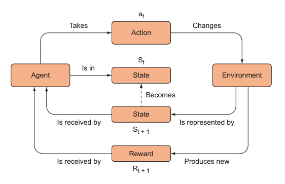

# Basics of RL

**Control Tasks:**
Problems where decisions must be made or some behaviour must be enacted, are collectively called control tasks.

Reinforcement Learning is a framework used for solving control tasks. Deep Learning can used in RL. This helps in solving the problem in a better approach. 
Deep RL can be defined in simple words as:

> *Deep Learning algorithm to accomplish some high-level task by assigning the completion of the task a high reward (i.e., positive reinforcement) and negatively reinforce if the path taken is wrong as we don't obtain the completion of required task*

Deep Learning tasks are often used to solve complex tasks such as image classification. But classical Deep Learning algorithms work on data alone without the aspect of *'time'*. These algorithms consider input data as some representation in '*space*'. *Time* aspect of RL in simple terms can be said as; previous decisions taken by the algorithm influences it's future decisions. 

### Dynamic Programming vs RL
DP (Dynamic Programming) works on the principal of dividing a complicated task in simpler and easy problems. Solving these problems would result in solving the original problem. In order to apply DP the problem has to be broken down into sub problems which are solvable by us. But real world problems cannot be easily broken down into sub problems. A high level goal such as *get to point B from point A without crashing* for a self-driving car is difficult to be solved by DP as we don't know how many sub crashing problems it can be divided into. 

Technically, this is termed as maximum knowledge of environment. High a high level knowledge of environment makes dividing into sub problems easier. But DP is not suitable for minimal knowledge. Here trial-end error approach is used which is termed as **Monte Carlo method**. 

### Terminologies in RL
1. **State:** Data from the environment taken at given timestamp.
2. **Objective Function:** The function used to represent the goal of the control task.
3. **Reward:** The reward is a (local) signal of how well the learning algorithm is performing at achieving the global objective.
4. **Agent:** Action-taking or decision-making learning algorithm in any RL problem.
5. **Transition probability:** The probability associated with mapping a state to a new state by taking an action is called the transition probability.
6. **Policy Function:** A function that maps a state to a probability distribution over the set of possible actions in that state. 
7. **Value functions:**  Functions that map a state or a state-action pair to the expected value (the expected reward) of being in some state or taking some action in some state.

