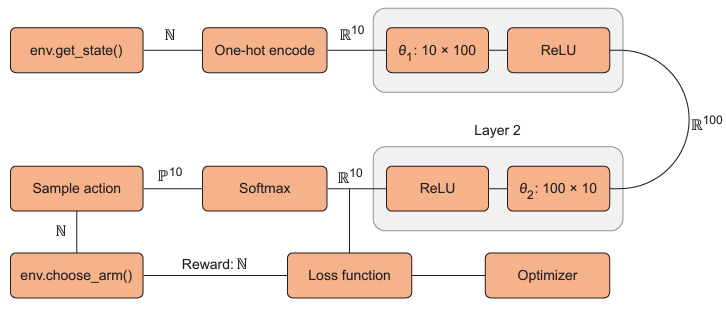

# Contextual Bandit

#### Problem Statement:
An extension of Multi Arm Bandit problem, Contextual Bandit is based on *state-space* and *action-space*. Multi-arm bandit is has action space alone. In case of contextual bandit, there is information which can be obtained from the environment. This introduces *state-space* to the problem. 
Example of this problem is providing advertisement in other websites. Along with *action-space* we have *state-space* .i.e information of the website which the ad will be displayed. 

### Markov's Decision Process (MDP):
> ***MDP** states that the current state alone contains enough information to choose optimal actions to maximise future rewards.*

MDP plays a major role in RL. It removes the necessity of storing previous states of the environment.  Driving a car follows MDP as previous state of the car would not be useful. Current state of the car is helpful enough to proceed further. But predicting which cricket team wins the match does not follow MDP as previous matches won or lost matters in predictions. 

Based on MDP, Contextual bandit problem is solved. The key aspect of the is that *n-states* have *n-reward distributions*. This leads the need to understand the relation ship between state and reward distribution. Hence we use a Neural Network to predict reward for given state. 



1. Get a state and one-hot encode it
2. Pass the state value to the Neural Network
3. Pass the predicted reward to Loss Function
4. Use softmax to obtain distribution of the state
5. Sample from distribution and pass it to arm and then to loss function. 
6. Error found by Loss function and then optimised.

Create a class with required functions:
```python
class ContextBandit:    
def __init__(self, arms=10):        
	self.arms = arms
	self.state = 0        
	self.init_distribution(arms)        
	self.update_state()            
	
def init_distribution(self, arms):              
	self.bandit_matrix = np.random.rand(arms,arms)   
	         
def reward(self, prob):        
	reward = 0        
	for i in range(self.arms):            
		if random.random() < prob:                
			reward += 1        
	return torch.Tesnor(reward)
	       
def get_state(self):        
	return self.state
	
 def update_state(self):        
	 self.state = torch.Tesnor(matrix[self.get_state()][arm])

 def choose_arm(self, arm):                   
	 reward = self.get_reward(arm)        
	 self.update_state()        
	 return torch.Tensor(reward)
```

Following PyTorch Code for the problem:
```python
import numpy as np 
import torch 

arms = 10 
N, D_in, H, D_out = 1, arms, 100, arms

model = torch.nn.Sequential(    
							torch.nn.Linear(D_in, H),
							torch.nn.ReLU(),    
							torch.nn.Linear(H, D_out),    
							torch.nn.ReLU(), 
							)

def one_hot(N, pos, val=1):    
	one_hot_vec = np.zeros(N)    
	one_hot_vec[pos] = val    
	return torch.Tensor(one_hot_vec)

env = ContextBandit(arms)
loss_fn = torch.nn.MSELoss()
cur_state = env.get_state()

EPOCHS = 3000
lr = 1e-2
optimiser = torch.optim.Adam(model.parameters(), lr=learning_rate)
rewrads = []

for epoch in range(epochs):

	# Perform reward prediction
	y_pred = model(cur_state)

	# Calculate the distribution
	av_softmax = softmax(y_pred.data.numpy(), tau=2.0)           
	av_softmax /= av_softmax.sum() # Normalisation

	# Perform a random choice
	choice = np.random.choice(arms, p=av_softmax)
	cur_reward = env.choose_arm(choice) 
	rewards.append(cur_reward)

	one_hot_reward = y_pred.data.numpy().copy() 
	one_hot_reward[choice] = cur_reward    

	# Optimise the NN
	loss = loss_fn(y_pred, cur_reward)        
	optimizer.zero_grad()        
	loss.backward()        
	optimizer.step()        
	cur_state = one_hot(arms, env.get_state())
```


